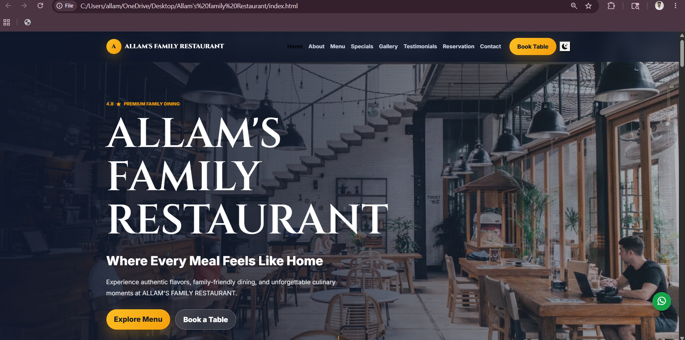
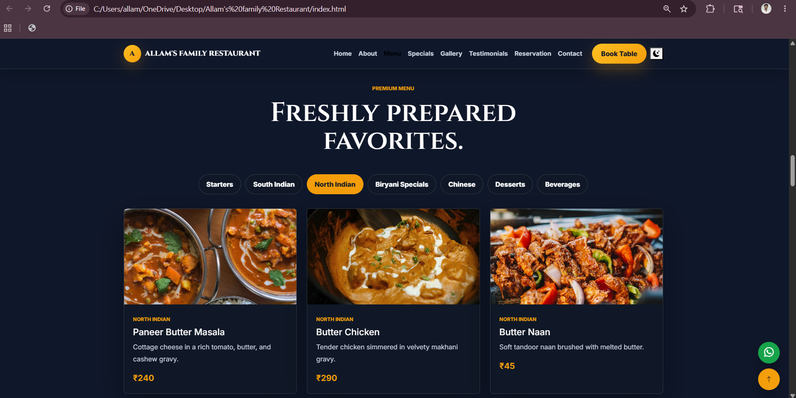
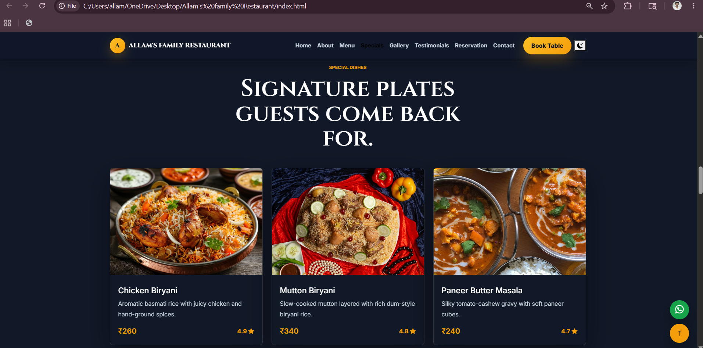
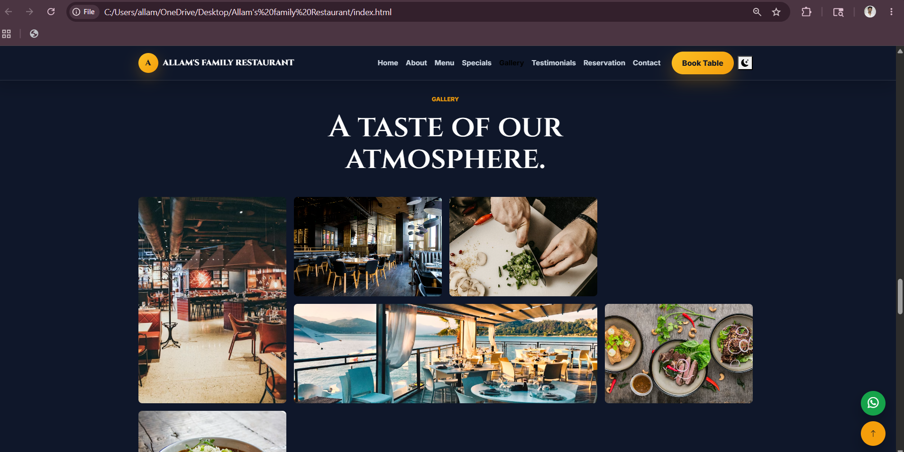
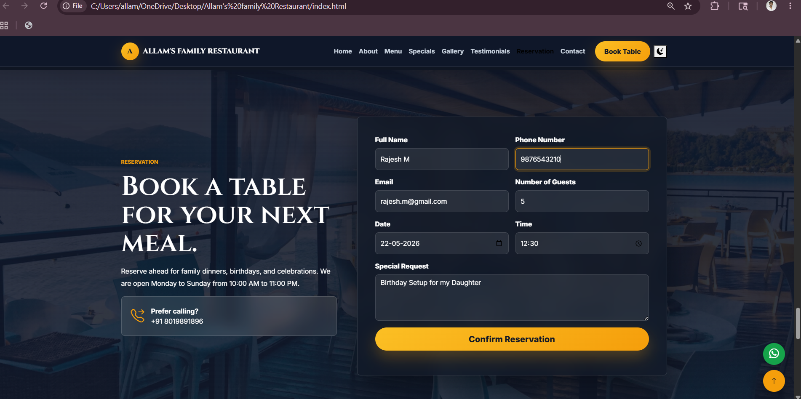

# Real Local Business Website


---

## 📖 Project Overview

**ALLAM'S FAMILY RESTAURANT** is a modern and fully responsive restaurant website developed as part of the **Future Interns Full Stack Web Development Internship (Task 3)**.

The website provides customers with a professional online experience by showcasing restaurant services, menu offerings, featured dishes, gallery images, reservation facilities, and contact information.

This project focuses on frontend web development, responsive design, UI/UX principles, and business-oriented website solutions.

---

## 🎯 Problem Statement

Many local restaurants depend only on offline customers or social media pages for business visibility.

Without a dedicated website, customers may face difficulties in:

- Finding restaurant information
- Viewing menus and pricing
- Making reservations
- Exploring services and specialties
- Building trust through a professional online presence

This website solves these challenges by creating a digital platform that improves accessibility, customer engagement, and restaurant branding.

---

## ✨ Key Features

### 🏠 Home Section
- Attractive hero banner
- Restaurant branding
- Call-to-action buttons

### 🍽️ Menu Section
- Food categories
- Pricing information
- Beautiful food presentation

### ⭐ Featured Dishes
- Popular dishes showcase
- Restaurant specials

### 🖼️ Gallery Section
- Food photography
- Restaurant ambience images

### 📅 Reservation System
- Table booking form
- Customer inquiries

### 📞 Contact Section
- Contact details
- Business information

### 📱 Responsive Design
- Mobile Friendly
- Tablet Friendly
- Desktop Friendly

### 🌙 Dark / Light Theme
- Theme switching functionality

### 💬 WhatsApp Integration
- Direct customer communication

### 🚀 Additional Features
- Smooth animations
- Scroll-to-top button
- Modern UI design

---

## 🛠️ Technologies Used

| Technology | Purpose |
|------------|----------|
| HTML5 | Website Structure |
| CSS3 | Styling & Layout |
| JavaScript | Interactivity |
| Bootstrap 5 | Responsive Framework |
| Bootstrap Icons | Icons |
| AOS Library | Scroll Animations |
| Git | Version Control |
| GitHub | Project Hosting |

---

## 📸 Project Screenshots

### 🏠 Home Page



*Modern landing page showcasing restaurant branding, promotions, and customer engagement.*

---

### 🍽️ Menu Section



*Displays a variety of food items, categories, and pricing information.*

---

### ⭐ Featured Dishes



*Highlights the restaurant's most popular and signature dishes.*

---

### 🖼️ Gallery



*Showcases food photography and the restaurant's ambience.*

---

### 📞 Contact & Reservation



*Provides reservation options, contact details, and customer inquiry support.*

---

## 📂 Project Structure


```text
FUTURE_FS_03
│
├── index.html
├── README.md
├── css/
├── js/
├── assets/
│   └── food/
└── screenshots/
```

---

## ⚙️ Installation

### Clone Repository

```bash
git clone https://github.com/allambharathsai/FUTURE_FS_03.git
```

### Navigate to Project Folder

```bash
cd FUTURE_FS_03
```

### Run the Website

Simply open:

```bash
index.html
```

in your preferred browser.

---

## 💼 Business Benefits

This website helps the restaurant by:

✅ Improving online visibility

✅ Enhancing customer engagement

✅ Showcasing menu offerings

✅ Providing reservation facilities

✅ Building customer trust

✅ Strengthening brand identity

✅ Creating a professional digital presence

---

## 🎓 Learning Outcomes

Through this project, I gained practical experience in:

- Responsive Web Design
- Frontend Development
- Bootstrap Framework
- JavaScript Functionality
- UI/UX Design
- Business Website Development
- Git & GitHub Workflow
- Real-World Project Development

This project enhanced my understanding of how websites can help local businesses attract customers and improve their online presence.

---

## 🚀 Future Enhancements

- Online Food Ordering
- Real-Time Table Reservation
- Online Payments
- Customer Reviews & Ratings
- Google Maps Integration
- Admin Dashboard
- Email Notifications
- SEO Optimization
- AI Chatbot Support
- Restaurant Analytics

---

## 🏢 Internship Information

| Field | Details |
| --- | --- |
| Organization | Future Interns |
| Track | Full Stack Web Development |
| Task Number | Task 3 |
| Project | ALLAM'S FAMILY RESTAURANT |
| Repository | FUTURE_FS_03 |

## 👨‍💻 Developer

**ALLAM BHARATH SAI**

B.Tech Computer Science and Engineering

Passionate about Full Stack Development, Web Technologies, Software Engineering, UI/UX Design, Problem Solving, and building real-world applications.

### Technical Skills

- HTML5
- CSS3
- JavaScript
- Bootstrap 5
- Responsive Web Design
- UI/UX Design
- Git & GitHub

### Professional Summary

I developed **ALLAM'S FAMILY RESTAURANT** as part of the **Future Interns Full Stack Web Development Internship**.

This project provided practical experience in designing and developing a professional restaurant website for a real-world local business. The website was created to strengthen the restaurant's online presence, showcase menu offerings, provide reservation facilities, and improve customer engagement through a modern and responsive user interface.

Through this project, I strengthened my skills in:

- Frontend Web Development
- Responsive Website Design
- Bootstrap Framework
- JavaScript Interactivity
- UI/UX Design Principles
- Business Website Development
- Website Optimization
- Git & GitHub Version Control

One of the most valuable lessons from this project was understanding how a professional website can help local businesses improve visibility, attract customers, build credibility, and enhance overall customer experience in the digital world.

### Connect With Me

[](https://github.com/allambharathsai)

[](https://www.linkedin.com/in/allambharathsai/)

## 📄 License

This project is created for internship and educational purposes.
